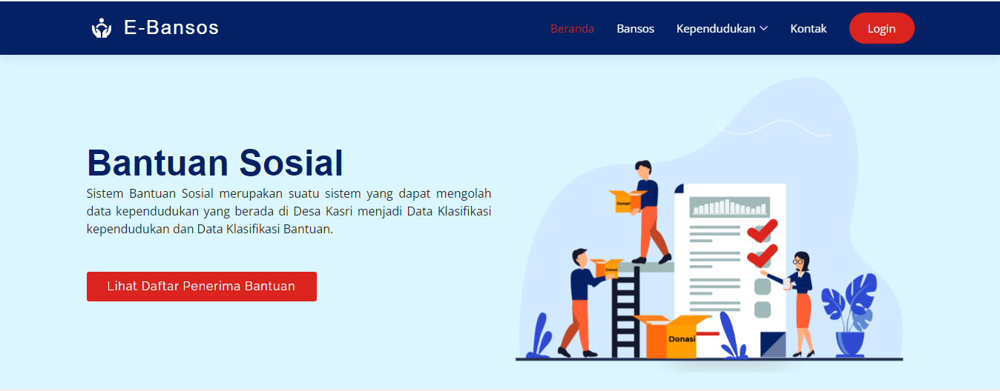
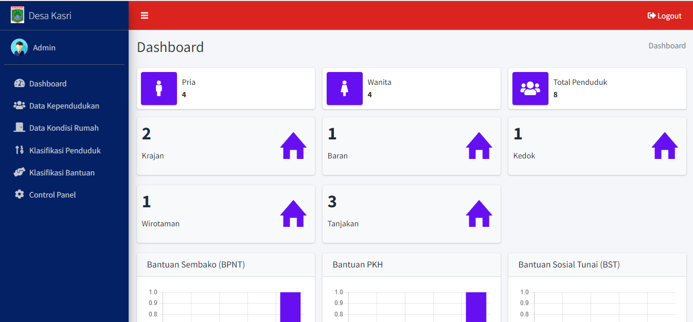

# E-Bansos
Sistem Informasi Manajemen Bantuan Sosial menggunakan PHP dan MySQL serta template menggunakan AdminLTE

## Beranda

## Dashboard

## Tutorial
1. download setelah itu extract dan letakkan pada folder xampp -> htdocs
2. buka aplikasi xampp start Msql dan Apache, lalu buka PhpmyAdmin dibrowser, kemudian import database simkbs.sql
3. buka tab baru ketikkan localhost/simkbs/
4. masukkan username: Admin dan Password: admin